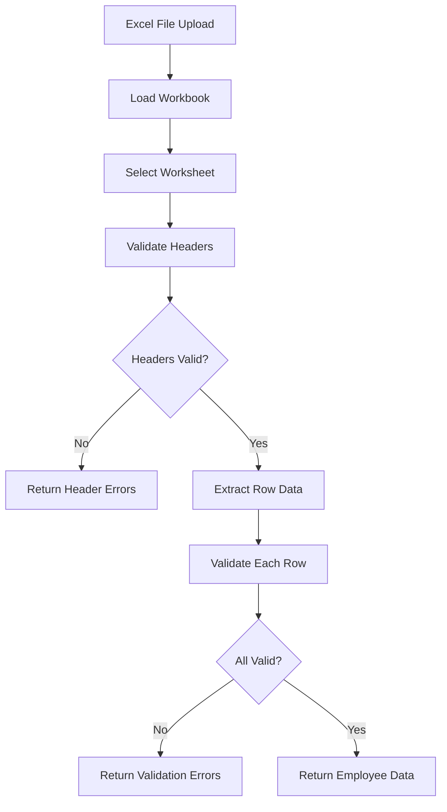

## Overview

Kontrak Backend provides robust Excel file processing capabilities using **ExcelJS**. The system can import employee data, validate fields, handle multiple contract types, and provide detailed error reporting for invalid data.

## Excel Parser Service

The `ExcelParserService` is the core service for Excel file processing:

```typescript src/services/excel-parser.service.ts
export class ExcelParserServices {
  async validateExcel(
    buffer: Buffer,
    fields: Record<string, FieldConfig>,
    options: ImportOptions,
  ): Promise<ValidationResult> {
    // Import data from Excel
    const rowData = await this.importExcelFromBuffer(buffer, fields, options);
    
    // Validate employee data
    const validation = this.validationService.validateEmployeeInbatch(rowData);
    
    if (validation.errors.length > 0) {
      throw new AppError(
        `No se pudo procesar el archivo. Se encontraron ${validation.errors.length} errores.`,
        BAD_REQUEST,
        { validationErrors: cleansErrors }
      );
    }
    
    return {
      employees: validation.validEmployees || [],
      totalRecords: rowData.length
    };
  }
}
```

## Import Process Flow



## Import Options

Configure Excel import behavior with `ImportOptions`:

```typescript src/services/excel-parser.service.ts
export interface ImportOptions {
  sheetIndex?: number;        // Sheet index (0, 1, 2...) - default: 0
  sheetName?: string;         // Sheet name (overrides sheetIndex)
  skipEmptyRows?: boolean;    // Skip empty rows - default: true
  skipEmptyCells?: boolean;   // Skip empty cells
  headerRow?: number;         // Header row number - default: 1
}
```

<Tabs>
  <Tab title="Basic Usage">
    ```typescript
    const options: ImportOptions = {
      headerRow: 1,
      skipEmptyRows: true
    };
    
    const result = await excelParser.validateExcel(
      fileBuffer,
      CONTRACT_FIELDS_MAP,
      options
    );
    ```
  </Tab>
  
  <Tab title="Specific Sheet">
    ```typescript
    const options: ImportOptions = {
      sheetName: 'Empleados 2024',  // Use specific sheet
      headerRow: 1
    };
    ```
  </Tab>
  
  <Tab title="Multiple Sheets">
    ```typescript
    const options: ImportOptions = {
      sheetIndex: 2,  // Use third sheet (0-based index)
      headerRow: 2    // Headers in row 2
    };
    ```
  </Tab>
</Tabs>

## Excel File Structure

### Expected Format

Kontrak Backend expects Excel files with:
- **Header row** containing column names (typically row 1)
- **Data rows** with employee information starting immediately after headers
- **One employee per row**
- **Contract type column** specifying PLANILLA, SUBSIDIO, or PART TIME

### Example Excel Layout

<Note>
  Column order doesn't matter - the system uses flexible header matching with multiple aliases.
</Note>

| Nombre | Apellido Paterno | Apellido Materno | DNI | Email | Cargo | Tipo de Contrato | Salario | Fecha Ingreso | Fecha Fin |
|--------|-----------------|------------------|-----|-------|-------|-----------------|---------|---------------|----------|
| Juan | García | López | 12345678 | juan@example.com | Operador | PLANILLA | 1500.00 | 01/01/2024 | 31/12/2024 |
| Ana | Martínez | Sánchez | 87654321 | ana@example.com | Supervisor | SUBSIDIO | 2000.00 | 01/06/2024 | 30/09/2024 |

## Header Validation

The system validates Excel headers before processing data:

### Header Mapping

```typescript src/validators/excel-headers.validator.ts
export function validateAndGetHeaderMapping(
  worksheet: ExcelJS.Worksheet,
  fields: Record<string, FieldConfig>,
  headerRow: number = 1,
): Map<string, string> {
  const result = validateExcelHeaders(worksheet, fields, headerRow);
  
  if (!result.isValid) {
    const headerErrors = result.missingHeaders.map((headerName) => ({
      row: headerRow,
      field: headerName,
      message: 'Encabezado requerido no encontrado en el archivo.'
    }));
    
    throw new AppError(
      'La estructura del archivo es incorrecta. Faltan columnas obligatorias.',
      BAD_REQUEST,
      { validationErrors: headerErrors }
    );
  }
  
  return result.headerMapping;
}
```

### Header Normalization

Headers are normalized for flexible matching:

```typescript src/validators/excel-headers.validator.ts
function normalizeHeader(header: string): string {
  return header
    .toLowerCase()
    .trim()
    .replace(/\s+/g, '')        // Remove spaces
    .normalize('NFD')
    .replace(/[\u0300-\u036f]/g, ''); // Remove accents
}
```

**Examples:**
- `"Apellido Paterno"` → `"apellidopaterno"`
- `"APELLIDO PATERNO"` → `"apellidopaterno"`
- `"apellido_paterno"` → `"apellidopaterno"`

### Field Aliases

Each field accepts multiple header names:

```typescript src/constants/contract-field.ts
contractType: {
  aliases: [
    'tipo de contrato',
    'Tipo Contrato',
    'tipodecontrato',
    'tipo_de_contrato',
    'tipo contrato',
    'TIPO DE CONTRATO'
  ],
  description: 'Tipo de contrato del empleado'
}
```

<Info>
  The system automatically matches Excel column headers to internal field names using normalized comparison.
</Info>

## Data Extraction

### Cell Value Extraction

The parser handles various Excel cell types:

```typescript src/services/excel-parser.service.ts
private extractCellValue(
  cell: ExcelJS.Cell,
): string | number | boolean | Date | null {
  const value = cell.value;
  
  if (value === null || value === undefined) return null;
  
  // Preserve primitive types
  if (typeof value === 'number' || 
      typeof value === 'boolean' || 
      value instanceof Date) {
    return value;
  }
  
  // Handle strings
  if (typeof value === 'string') {
    const trimmed = value.trim();
    return trimmed === '' ? null : trimmed;
  }
  
  // Handle rich text
  if (typeof value === 'object' && 'text' in value) {
    const text = String(value.text).trim();
    return text === '' ? null : text;
  }
  
  // Handle formulas
  if (typeof value === 'object' && 'result' in value) {
    return value.result;
  }
  
  return String(value).trim() || null;
}
```

### Special Field Processing

<Accordion title="Field-Specific Transformations">
  <AccordionItem title="DNI (Document Number)">
    DNI values are automatically converted from numbers to strings:
    
    ```typescript
    if ((field === 'dni' || field === 'documentNumber') && 
        typeof value === 'number') {
      finalValue = String(value);
    }
    ```
    
    **Example:** `12345678` (number) → `"12345678"` (string)
  </AccordionItem>
  
  <AccordionItem title="Dates">
    Excel date values are formatted as `DD/MM/YYYY`:
    
    ```typescript
    if (field === 'entryDate' || field === 'endDate' || field === 'birthDate') {
      if (value instanceof Date) {
        const day = String(value.getUTCDate()).padStart(2, '0');
        const month = String(value.getUTCMonth() + 1).padStart(2, '0');
        const year = value.getUTCFullYear();
        finalValue = `${day}/${month}/${year}`;
      }
    }
    ```
    
    **Example:** `Date(2024-01-15)` → `"15/01/2024"`
  </AccordionItem>
  
  <AccordionItem title="Salary">
    Salary values handle currency symbols and formatting:
    
    ```typescript
    if (field === 'salary') {
      if (typeof value === 'string') {
        // Remove S/. prefix and clean formatting
        let cleanValue = value.replace(/^S\/\.?\s*/i, '').trim();
        cleanValue = cleanValue.replace(/\./g, '').replace(',', '.');
        const num = Number(cleanValue);
        finalValue = isNaN(num) ? null : num;
      }
    }
    ```
    
    **Examples:**
    - `"S/. 1,500.00"` → `1500.00`
    - `"1500"` → `1500`
    - `"S/ 2,000.50"` → `2000.50`
  </AccordionItem>
  
  <AccordionItem title="Empty Strings">
    Empty strings are converted to `null`:
    
    ```typescript
    if (typeof value === 'string' && value.trim() === '') {
      finalValue = null;
    }
    ```
  </AccordionItem>
</Accordion>

## Validation Process

After extraction, employee data goes through comprehensive validation:

### Batch Validation

```typescript src/services/validation.service.ts
validateEmployeeInbatch(rows: Record<string, unknown>[]): {
  errors: ValidationError[];
  validEmployees?: EmployeeData[];
} {
  const errors: ValidationError[] = [];
  const validEmployees: EmployeeData[] = [];
  const dniSet = new Set<string>();
  
  rows.forEach((rowData, index) => {
    const rowNumber = index + 2;  // Account for header row
    const validation = this.validateEmployee(rowData, rowNumber, dniSet);
    
    if (validation.errors.length > 0) {
      errors.push(...validation.errors);
    } else if (validation.employee) {
      validEmployees.push(validation.employee);
    }
  });
  
  return { errors, validEmployees };
}
```

### Validation Checks

<Steps>
  <Step title="Contract Type Validation">
    Verify the contract type is valid (PLANILLA, SUBSIDIO, or PART TIME):
    
    ```typescript
    const rawContractType = String(rowData.contractType || '')
      .trim()
      .toUpperCase();
    
    if (!CONTRACT_TYPES.includes(rawContractType as ContractType)) {
      return { errors: [] };  // Skip invalid types
    }
    ```
  </Step>
  
  <Step title="DNI Uniqueness">
    Check for duplicate DNIs within the same file:
    
    ```typescript
    if (dniSet.has(dni)) {
      errors.push({
        error: new AppError(
          `El DNI ${dni} ya existe en el archivo (duplicado)`,
          BAD_REQUEST
        ),
        row: rowNumber,
        field: 'DNI',
      });
    }
    ```
  </Step>
  
  <Step title="Schema Validation">
    Validate against Zod schema for data types and formats:
    
    ```typescript
    const result = employeeSchema.safeParse(rowData);
    
    if (!result.success) {
      const validationErrors = result.error.issues.map((issue) => ({
        row: rowNumber,
        field: issue.path.join('.'),
        error: new AppError(issue.message, BAD_REQUEST),
      }));
      return { errors: validationErrors };
    }
    ```
  </Step>
  
  <Step title="Contract-Specific Validation">
    Verify required fields for each contract type are present (e.g., SUBSIDIO contracts must have `replacementFor` and `reasonForSubstitution`).
  </Step>
</Steps>

## Error Handling

### Error Types

<CodeGroup>
  ```typescript Header Errors
  {
    row: 1,
    field: 'apellido paterno',
    message: 'Encabezado requerido no encontrado en el archivo.'
  }
  ```

  ```typescript Validation Errors
  {
    row: 5,
    field: 'dni',
    message: 'El DNI 12345678 ya existe en el archivo (duplicado)'
  }
  ```

  ```typescript Format Errors
  {
    row: 10,
    field: 'email',
    message: 'El email no tiene un formato válido'
  }
  ```

  ```typescript Missing Field Errors
  {
    row: 15,
    field: 'replacementFor',
    message: 'Este campo es requerido para contratos SUBSIDIO'
  }
  ```
</CodeGroup>

### Error Response Structure

```typescript
throw new AppError(
  'No se pudo procesar el archivo. Se encontraron N errores.',
  BAD_REQUEST,
  {
    validationErrors: [
      { row: 2, field: 'dni', message: 'DNI es requerido' },
      { row: 3, field: 'email', message: 'Email inválido' },
      // ... more errors
    ]
  }
);
```

<Warning>
  When validation errors occur, the entire batch is rejected. Fix all errors and re-upload the corrected Excel file.
</Warning>

## Common Excel Issues

<Accordion title="Troubleshooting Guide">
  <AccordionItem title="Missing Required Headers">
    **Problem:** Excel file is missing required column headers.
    
    **Solution:**
    - Check that all required columns are present
    - Verify column names match accepted aliases
    - Ensure header row is in the expected position (usually row 1)
    
    **Required headers vary by contract type** - see [Contract Types](/concepts/contract-types) for details.
  </AccordionItem>
  
  <AccordionItem title="Duplicate DNI Values">
    **Problem:** Same DNI appears multiple times in the file.
    
    **Solution:**
    - Check for accidentally duplicated rows
    - Verify each employee has a unique DNI
    - Remove or correct duplicate entries
  </AccordionItem>
  
  <AccordionItem title="Invalid Date Format">
    **Problem:** Dates not recognized or formatted incorrectly.
    
    **Solution:**
    - Use Excel date format, not text
    - Ensure dates are valid calendar dates
    - Check that end dates are after start dates
    - Format cells as "Date" in Excel
  </AccordionItem>
  
  <AccordionItem title="Salary Formatting Issues">
    **Problem:** Salary values not parsed correctly.
    
    **Solution:**
    - Remove or keep "S/." prefix (both work)
    - Use proper decimal separators
    - Avoid mixing formats in the same column
    - Format as number or currency in Excel
  </AccordionItem>
  
  <AccordionItem title="Corrupt or Invalid File">
    **Problem:** File cannot be opened or parsed.
    
    **Solution:**
    - Ensure file is a valid .xlsx or .xls format
    - Try opening in Excel to verify integrity
    - Re-save the file if corrupted
    - Check file size limits
  </AccordionItem>
  
  <AccordionItem title="Empty Rows Breaking Import">
    **Problem:** Empty rows causing issues.
    
    **Solution:**
    - Set `skipEmptyRows: true` in import options (default)
    - Remove empty rows from Excel file
    - Ensure data is continuous without gaps
  </AccordionItem>
</Accordion>

## Field Configuration

Fields are configured with aliases and descriptions:

```typescript src/constants/contract-field.ts
export interface FieldConfig {
  aliases: string[];     // Accepted column names
  description: string;   // Field purpose
}

export const BASE_FIELDS: Record<string, FieldConfig> = {
  name: {
    aliases: [
      'nombre',
      'name',
      'NOMBRE COMPLETO',
      'Nombre completo'
    ],
    description: 'Nombre del empleado'
  },
  // ... more fields
};
```

### Field Maps

<Tabs>
  <Tab title="Contract Fields">
    ```typescript
    export const CONTRACT_FIELDS_MAP: Record<string, FieldConfig> = {
      ...BASE_FIELDS,
      ...COMMON_CONTRACT_FIELDS,
      ...SUBSIDIO_SPECIFIC_FIELDS,
      ...LOCATION_FIELDS,
    };
    ```
    
    Used for importing employee contracts from Excel.
  </Tab>
  
  <Tab title="Addendum Fields">
    ```typescript
    export const ADDENDUM_FIELDS_MAP: Record<string, FieldConfig> = {
      ...ADDENDUM_FIELDS,
      ...LOCATION_FIELDS,
    };
    ```
    
    Used for importing contract addendums (amendments).
  </Tab>
</Tabs>

## Performance Considerations

<Info>
  The Excel parser uses streaming for efficient memory usage, even with large files.
</Info>

- **Batch processing:** All rows validated in a single pass
- **Early termination:** Stops on critical errors (corrupt file, missing headers)
- **Memory efficient:** Processes rows incrementally
- **Large file support:** Can handle thousands of employee records

## Example Usage

```typescript
import { ExcelParserServices } from './services/excel-parser.service';
import { CONTRACT_FIELDS_MAP } from './constants/contract-field';

const excelParser = new ExcelParserServices();

try {
  const result = await excelParser.validateExcel(
    fileBuffer,
    CONTRACT_FIELDS_MAP,
    {
      headerRow: 1,
      skipEmptyRows: true
    }
  );
  
  console.log(`✅ Successfully imported ${result.totalRecords} employees`);
  console.log(`Valid employees: ${result.employees.length}`);
  
  // Process validated employees
  for (const employee of result.employees) {
    await generateContract(employee);
  }
} catch (error) {
  if (error instanceof AppError) {
    console.error('Validation errors:', error.context?.validationErrors);
  }
}
```

## Related Topics

<CardGroup cols={2}>
  <Card title="Employee Data Structure" icon="users" href="/concepts/employee-data">
    Complete field reference and validation rules
  </Card>
  <Card title="Contract Types" icon="file-contract" href="/concepts/contract-types">
    Required fields for each contract type
  </Card>
  <Card title="API: Upload Excel" icon="upload" href="/api/excel/upload">
    Upload and validate Excel files via API
  </Card>
  <Card title="Configuration Guide" icon="gear" href="/guides/configuration">
    Configure field aliases and validation
  </Card>
</CardGroup>