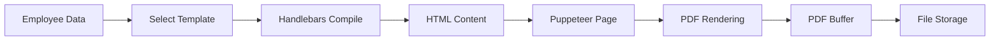

## Overview

Kontrak Backend uses **Puppeteer** (headless Chrome) to generate high-quality PDF contracts from HTML templates. The system combines Handlebars templating with precise PDF rendering to create professional, print-ready employment contracts.

## Architecture



## PDF Generator Service

The `PDFGeneratorService` is the core service responsible for contract PDF generation.

```typescript src/services/pdf-generator.service.ts
export class PDFGeneratorService {
  /**
   * Genera un contrato PDF basado en el tipo de contrato
   */
  async generateContract(
    employeeData: EmployeeData,
    contractType: ContractType,
    browser: Browser,
  ): Promise<{ buffer: Buffer; filename: string }> {
    // Validation
    if (!employeeData || !employeeData.dni) {
      throw new AppError(
        'Faltand datos del empleado para visualizar el contrato',
        400,
      );
    }

    let buffer: Buffer;

    // Generate based on contract type
    switch (contractType.toLowerCase()) {
      case 'planilla':
        buffer = await generatePlanillaContract(employeeData, browser);
        break;
      case 'subsidio':
        buffer = await generateSubsidioContract(employeeData, browser);
        break;
      case 'part time':
      case 'parttime':
        buffer = await generatePartTimeContract(employeeData, browser);
        break;
      default:
        throw new Error(`Tipo de contrato desconocido: ${contractType}`);
    }

    const filename = `${employeeData.dni}.pdf`;
    return { buffer, filename };
  }
}
```

<Note>
  PDFs are named using the employee's DNI (e.g., `12345678.pdf`) for easy identification and retrieval.
</Note>

## Template System

Kontrak Backend uses **Handlebars** templates for rendering contracts. Each contract type has its own template with specific fields and layout.

### Template Structure

Templates are stored in `src/template/templates.ts` and include:
- `CONTRACT_FULL_TIME` - PLANILLA contracts
- `CONTRACT_PART_TIME` - PART TIME contracts  
- `CONTRACT_SUBSIDIO` - SUBSIDIO contracts
- `ANEXO` - Addendum documents

### Template Compilation Process

<Steps>
  <Step title="Compile Template">
    Handlebars compiles the HTML template string into a reusable function
    
    ```typescript
    const template = Handlebars.compile(CONTRACT_FULL_TIME);
    ```
  </Step>
  
  <Step title="Inject Data">
    Employee data is injected into the template placeholders
    
    ```typescript
    const finalHtml = template({
      fullName: `${data.name} ${data.lastNameFather} ${data.lastNameMother}`,
      dni: data.dni,
      salary: salaryFormatted,
      // ... more fields
    });
    ```
  </Step>
  
  <Step title="Render HTML">
    The final HTML is loaded into a Puppeteer page
    
    ```typescript
    const page = await browser.newPage();
    await page.setContent(finalHtml, { waitUntil: 'networkidle0' });
    ```
  </Step>
  
  <Step title="Generate PDF">
    Puppeteer renders the page as a PDF with specific settings
    
    ```typescript
    const pdfBuffer = await page.pdf({
      format: 'Letter',
      printBackground: true,
      preferCSSPageSize: true,
      margin: { top: '2.12cm', bottom: '0.49cm', ... }
    });
    ```
  </Step>
</Steps>

## Contract-Specific Generation

<Tabs>
  <Tab title="PLANILLA">
    ### Full-Time Contract Generation

    ```typescript src/template/contracts.ts
    export const generatePlanillaContract = async (
      data: EmployeeData,
      browser: Browser,
    ): Promise<Buffer> => {
      // Format salary with locale
      const salaryFormatted = Number(data.salary).toLocaleString('es-PE', {
        minimumFractionDigits: 2,
        maximumFractionDigits: 2,
      });
      
      const template = Handlebars.compile(CONTRACT_FULL_TIME);
      const finalHtml = template({
        // Employee data
        fullName: `${data.name} ${data.lastNameFather} ${data.lastNameMother}`,
        dni: data.dni,
        address: data.address,
        district: data.district,
        province: data.province,
        department: data.department,
        email: data.email,
        position: data.position,
        entryDate: data.entryDate,
        endDate: data.endDate,
        salary: salaryFormatted,
        salaryInWords: data.salaryInWords,
        probationaryPeriod: data.probationaryPeriod,
        subDivision: data.subDivisionOrParking,
        
        // Company signers
        signer1Name: FULL_NAME_PRIMARY_EMPLOYEE,
        signer1DNI: DNI_EMPLOYEE_PRIMARY,
        signer2Name: FULL_NAME_SECOND_EMPLOYEE,
        signer2DNI: DNI_EMPLOYEE_SECOND,
        signature1: SIGNATURE_EMPLOYEE,
        signature2: SIGNATURE_EMPLOYEE_TWO,
      });

      const page = await browser.newPage();
      await page.setContent(finalHtml, { waitUntil: 'networkidle0' });

      const pdfBuffer = await page.pdf({
        format: 'Letter',
        printBackground: true,
        preferCSSPageSize: true,
        margin: {
          top: '2.12cm',
          bottom: '0.49cm',
          left: '1.41cm',
          right: '2.26cm',
        },
      });

      await page.close();
      return Buffer.from(pdfBuffer);
    };
    ```

    **Key Features:**
    - Locale-formatted salary (Spanish/Peru format)
    - All standard employment fields
    - Probationary period clause
    - Dual company signatures
    - Letter format (8.5" x 11")
  </Tab>
  
  <Tab title="SUBSIDIO">
    ### Replacement Contract Generation

    ```typescript src/template/contracts.ts
    export const generateSubsidioContract = async (
      data: EmployeeData,
      browser: Browser,
    ): Promise<Buffer> => {
      // Format full name (last names first)
      const fullName = `${data.lastNameFather} ${data.lastNameMother} ${data.name}`
        .trim()
        .replace(/\s+/g, ' ');

      // Parse replacement employee name
      const replacementForArray = data.replacementFor?.split(' ');
      const firstAndfirstLastName = 
        `${replacementForArray?.[0]} ${replacementForArray?.[1]}`;
      const secondLastName = `${replacementForArray?.[2]}`;
      
      // Format salary with currency
      const salaryFormatted = formatCurrency(Number(data.salary));
      
      const template = Handlebars.compile(CONTRACT_SUBSIDIO);
      const finalHtml = template({
        ...data,
        fullName,
        firstAndfirstLastName,
        secondLastName,
        salaryFormatted,
        signer1Name: FULL_NAME_PRIMARY_EMPLOYEE,
        signer1DNI: DNI_EMPLOYEE_PRIMARY,
        signer2Name: FULL_NAME_SECOND_EMPLOYEE,
        signer2DNI: DNI_EMPLOYEE_SECOND,
        signature1: SIGNATURE_EMPLOYEE,
        signature2: SIGNATURE_EMPLOYEE_TWO,
      });

      const page = await browser.newPage();
      await page.setContent(finalHtml, { waitUntil: 'networkidle0' });

      const pdfBuffer = await page.pdf({
        format: 'Letter',
        printBackground: true,
        preferCSSPageSize: true,
        margin: {
          top: '1.75cm',
          bottom: '1.75cm',
          left: '3cm',
          right: '1.84cm',
        },
      });

      await page.close();
      return Buffer.from(pdfBuffer);
    };
    ```

    **Key Features:**
    - Special name formatting (last names first)
    - Replacement employee name parsing
    - Currency-formatted salary
    - SUBSIDIO-specific fields included
    - Wider left margin for binding
  </Tab>
  
  <Tab title="PART TIME">
    ### Part-Time Contract Generation

    ```typescript src/template/contracts.ts
    export const generatePartTimeContract = async (
      data: EmployeeData,
      browser: Browser,
    ): Promise<Buffer> => {
      const template = Handlebars.compile(CONTRACT_PART_TIME);
      const finalHtml = template({
        fullName: 
          `${data.name} ${data.lastNameFather} ${data.lastNameMother}`.trim(),
        dni: data.dni,
        address: data.address,
        district: data.district,
        province: data.province,
        department: data.department,
        position: data.position,
        salary: Number(data.salary).toFixed(2),
        salaryInWords: data.salaryInWords,
        email: data.email,
        entryDate: data.entryDate,
        subDivision: data.subDivisionOrParking,
        
        signer1Name: FULL_NAME_PRIMARY_EMPLOYEE,
        signer1DNI: DNI_EMPLOYEE_PRIMARY,
        signer2Name: FULL_NAME_SECOND_EMPLOYEE,
        signer2DNI: DNI_EMPLOYEE_SECOND,
        signature1: SIGNATURE_EMPLOYEE,
        signature2: SIGNATURE_EMPLOYEE_TWO,
      });

      const page = await browser.newPage();
      await page.setContent(finalHtml, { waitUntil: 'networkidle0' });

      const pdfBuffer = await page.pdf({
        format: 'Letter',
        printBackground: true,
        preferCSSPageSize: true,
        margin: {
          top: '2.05cm',
          bottom: '0.49cm',
          left: '1.73cm',
          right: '1.55cm',
        },
      });

      await page.close();
      return Buffer.from(pdfBuffer);
    };
    ```

    **Key Features:**
    - Fixed decimal salary format
    - Email field for communication
    - Subdivision/parking location
    - Balanced margins for readability
  </Tab>
</Tabs>

## PDF Configuration

### Page Format

All contracts use **Letter** format (8.5" x 11" / 21.59cm x 27.94cm):

```typescript
{
  format: 'Letter',
  printBackground: true,
  preferCSSPageSize: true
}
```

### Margins by Contract Type

Different contract types use optimized margins:

<CodeGroup>
  ```typescript PLANILLA
  margin: {
    top: '2.12cm',
    bottom: '0.49cm',
    left: '1.41cm',
    right: '2.26cm'
  }
  ```

  ```typescript SUBSIDIO
  margin: {
    top: '1.75cm',
    bottom: '1.75cm',
    left: '3cm',      // Wider for binding
    right: '1.84cm'
  }
  ```

  ```typescript PART TIME
  margin: {
    top: '2.05cm',
    bottom: '0.49cm',
    left: '1.73cm',
    right: '1.55cm'
  }
  ```
</CodeGroup>

## Browser Management

<Info>
  Puppeteer browser instances are managed at the application level and reused across requests for optimal performance.
</Info>

The browser instance is:
- Initialized once at application startup
- Shared across all PDF generation requests
- Properly closed on application shutdown
- Headless Chrome instance for server environments

```typescript
// Browser is passed to generation functions
await generateContract(employeeData, contractType, browser);
```

## File Naming Convention

Generated PDFs follow a simple, consistent naming pattern:

```typescript
const filename = `${employeeData.dni}.pdf`;
```

**Examples:**
- Employee with DNI `12345678` → `12345678.pdf`
- Employee with DNI `87654321` → `87654321.pdf`

<Warning>
  DNI-based naming ensures uniqueness but means regenerating a contract for the same employee will overwrite the previous file.
</Warning>

## Signatures

Contracts include digital signatures from two company representatives:

```typescript src/template/contracts.ts
import {
  SIGNATURE_EMPLOYEE,
  SIGNATURE_EMPLOYEE_TWO,
} from '../constants/signatures';

import {
  DNI_EMPLOYEE_PRIMARY,
  DNI_EMPLOYEE_SECOND,
  FULL_NAME_PRIMARY_EMPLOYEE,
  FULL_NAME_SECOND_EMPLOYEE,
} from './constants';
```

Signatures are embedded as base64 images or image URLs and positioned at the bottom of each contract.

## Error Handling

```typescript src/services/pdf-generator.service.ts
try {
  let buffer: Buffer;
  // ... generation logic
  return { buffer, filename };
} catch (error) {
  if (error instanceof Error) {
    logger.error(
      {
        err: error,
        message: error.message,
        stack: error.stack,
        dni: employeeData.dni,
      },
      '❌ Error generando PDF',
    );
  }
  throw error;
}
```

**Common Errors:**
- Missing employee data
- Invalid contract type
- Puppeteer page rendering failures
- Template compilation errors
- Font loading issues

## Performance Considerations

<Accordion title="Optimization Tips">
  <AccordionItem title="Browser Reuse">
    Reuse the same Puppeteer browser instance across requests instead of creating new instances for each PDF generation.
  </AccordionItem>
  
  <AccordionItem title="Page Cleanup">
    Always close pages after PDF generation to free memory:
    
    ```typescript
    await page.close();
    ```
  </AccordionItem>
  
  <AccordionItem title="Template Caching">
    Handlebars templates are compiled once and reused. Avoid re-compiling templates for each request.
  </AccordionItem>
  
  <AccordionItem title="Batch Processing">
    For multiple contracts, process them sequentially with the same browser instance rather than parallel instances.
  </AccordionItem>
</Accordion>

## Additional Documents

### Personal Data Processing Document

The system also generates a personal data processing consent document using **PDFKit**:

```typescript src/template/contracts.ts
export const generateProcessingOfPresonalDataPDF = async (
  data: EmployeeData,
): Promise<Buffer> => {
  const doc = new PDFDocument({
    size: 'A4',
    margins: {
      top: cmToPt(2.12),
      bottom: cmToPt(2.4),
      left: cmToPt(2.7),
      right: cmToPt(2.8),
    },
  });
  
  // Custom fonts
  doc.registerFont('Arial Bold', arialBold);
  doc.registerFont('Arial Normal', arialNormal);
  
  // Document content generation...
  
  return buffer;
};
```

This document uses **PDFKit** instead of Puppeteer for more granular control over text formatting and positioning.

## Related Topics

<CardGroup cols={2}>
  <Card title="Contract Types" icon="file-contract" href="/concepts/contract-types">
    Learn about the three contract types and their requirements
  </Card>
  <Card title="Employee Data" icon="users" href="/concepts/employee-data">
    Understand the data structure used in templates
  </Card>
  <Card title="API: Generate Contract" icon="code" href="/api/contracts/preview">
    Use the API to generate contract PDFs
  </Card>
  <Card title="Batch Processing" icon="layer-group" href="/api/contracts/download-zip">
    Generate multiple contracts at once
  </Card>
</CardGroup>