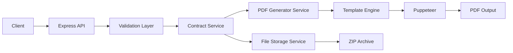

## What is Kontrak Backend?

Kontrak Backend is a powerful Node.js-based REST API that automates the generation of employment contracts and related documents. Built with Express and TypeScript, it streamlines the contract creation process by transforming employee data into professionally formatted PDF documents.

## Key Features

<CardGroup cols={2}>
  <Card title="Multi-Contract Support" icon="file-contract">
    Generate three types of employment contracts: Planilla (standard), Part Time, and Subsidio (substitution)
  </Card>
  <Card title="Batch Processing" icon="layer-group">
    Process up to 50 employees at once and download all contracts in a single ZIP file
  </Card>
  <Card title="Automated PDF Generation" icon="file-pdf">
    Uses Puppeteer and pdf-lib to generate high-quality, legally compliant contract PDFs
  </Card>
  <Card title="Data Validation" icon="shield-check">
    Built-in Zod schemas validate employee data to ensure accuracy and completeness
  </Card>
</CardGroup>

## Who Should Use Kontrak Backend?

This system is ideal for:

- **HR Departments**: Automate repetitive contract generation tasks
- **Staffing Agencies**: Handle large volumes of employee onboarding
- **Legal Teams**: Ensure consistent, compliant employment documentation
- **System Integrators**: Build employee management systems with contract generation capabilities

## Core Capabilities

### Contract Types

Kontrak Backend supports three distinct contract types, each with specific requirements:

<Tabs>
  <Tab title="PLANILLA">
    Standard full-time employment contracts with complete benefits and long-term engagement.
    
    **Required Fields:**
    - Employee personal information (name, DNI, address)
    - Position and salary details
    - Contract dates (entry and end date)
    - Subdivision or parking assignment
  </Tab>
  
  <Tab title="PART TIME">
    Part-time employment contracts for flexible work arrangements.
    
    **Required Fields:**
    - Same as PLANILLA
    - Adjusted for part-time working hours
  </Tab>
  
  <Tab title="SUBSIDIO">
    Substitution contracts for temporary employee replacements.
    
    **Additional Required Fields:**
    - Replacement for (who is being replaced)
    - Reason for substitution
    - Time in company
    - Working condition
    - Probationary period
  </Tab>
</Tabs>

### Document Generation

For each employee, the system automatically generates:

1. **Employment Contract**: Main contract document based on contract type
2. **Data Processing Agreement**: Personal data treatment consent (GDPR compliance)
3. **Annexes**: Additional documentation and forms

All documents are bundled together in an organized ZIP structure.

## Architecture Overview



### Technology Stack

<CodeGroup>
```json package.json
{
  "dependencies": {
    "express": "^5.1.0",
    "typescript": "^5.9.3",
    "zod": "^4.1.12",
    "puppeteer": "^24.34.0",
    "pdf-lib": "^1.17.1",
    "handlebars": "^4.7.8",
    "archiver": "^7.0.1"
  }
}
```
</CodeGroup>

**Core Technologies:**

- **Express 5.1**: Modern web framework for API endpoints
- **TypeScript 5.9**: Type-safe development with latest features
- **Zod 4.1**: Runtime type validation and schema definition
- **Puppeteer 24**: Headless Chrome for PDF generation
- **pdf-lib**: PDF manipulation and generation
- **Archiver**: ZIP file creation for batch downloads

### Project Structure

```
src/
├── controllers/          # Request handlers
│   ├── contract.controller.ts
│   └── addendum.controller.ts
├── services/            # Business logic
│   ├── contract.service.ts
│   ├── pdf-generator.service.ts
│   └── validation.service.ts
├── validators/          # Zod schemas
│   └── employee.validator.ts
├── middlewares/         # Express middlewares
│   ├── error-handle.middleware.ts
│   └── schema-validator.middleware.ts
├── types/              # TypeScript interfaces
│   ├── employees.interface.ts
│   └── contract.interface.ts
├── template/           # Contract templates
│   └── contracts.ts
└── config/             # Configuration
    └── index.ts
```

## API Endpoints

Kontrak Backend exposes a RESTful API with the following main endpoints:

| Endpoint | Method | Description |
|----------|--------|-------------|
| `/` | GET | Health check and API information |
| `/api/health` | GET | Server health status |
| `/api/contracts/download-zip` | POST | Generate and download contracts as ZIP |
| `/api/contracts/preview` | POST | Preview a single contract PDF |

<Note>
  All contract generation endpoints require validated employee data according to the Zod schemas defined in `src/validators/employee.validator.ts`.
</Note>

## Data Flow

1. **Request Reception**: Client sends employee data to the API
2. **Validation**: Data is validated against Zod schemas
3. **Processing**: Contract service processes each employee
4. **PDF Generation**: Puppeteer generates PDFs from HTML templates
5. **Bundling**: Documents are organized and archived
6. **Response**: ZIP file is streamed back to the client

## Next Steps

<CardGroup cols={2}>
  <Card title="Quick Start" icon="rocket" href="/quickstart">
    Get up and running in 5 minutes
  </Card>
  <Card title="Installation" icon="download" href="/installation">
    Detailed installation instructions
  </Card>
  <Card title="API Reference" icon="code" href="/api/overview">
    Complete API documentation
  </Card>
  <Card title="Configuration" icon="gear" href="/guides/configuration">
    Configure your environment
  </Card>
</CardGroup>
